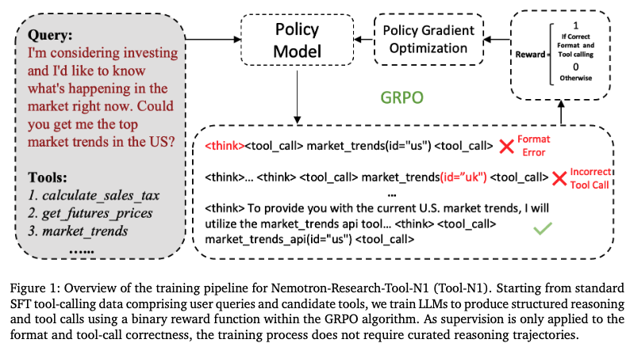
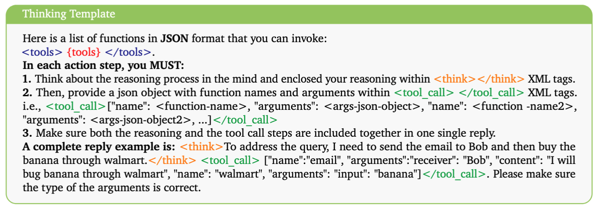
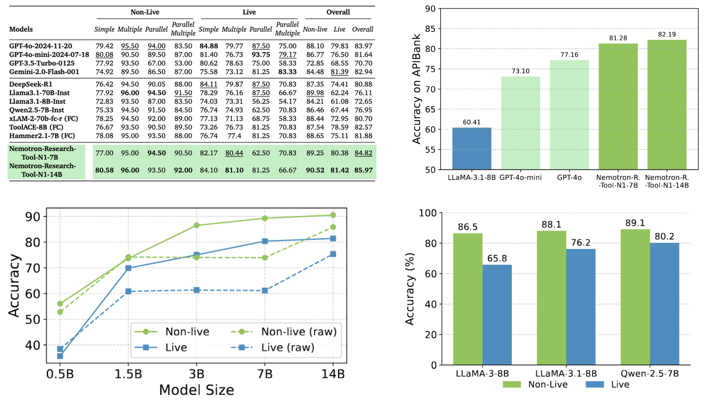
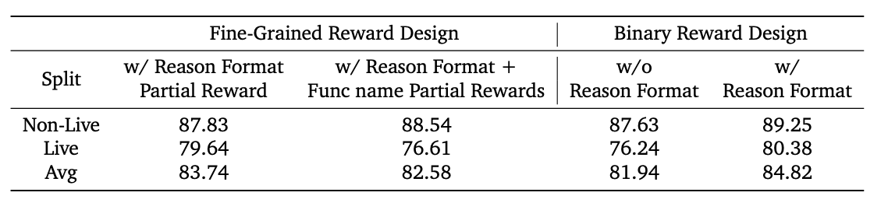
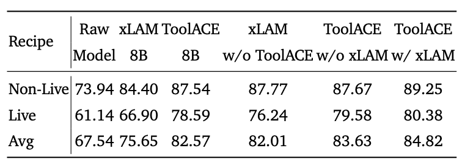
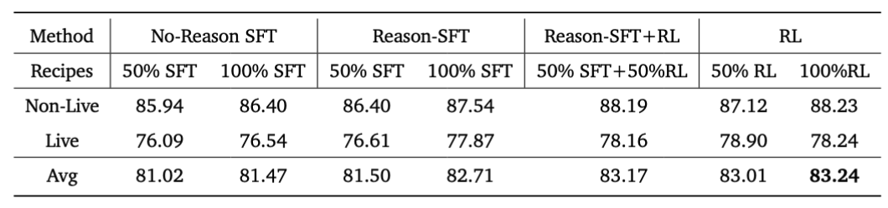

<div align="center">

# ***Nemotron-Research-Tool-N1***: Exploring Tool-Using Language Models with Reinforced Reasoning

[](https://arxiv.org/pdf/2505.00024)
</div>

> [!IMPORTANT]
> - **Please consider giving us a ⭐️ to stay updated on the upcoming code release!**

This is the official implementation of paper Nemotron-Research-Tool-N1: Exploring Tool-Using Language Models with Reinforced Reasoning, where we present Nemotron-Research-Tool-N1, a family of tool-using reasoning language models. These models are trained with an R1-style reinforcement learning algorithm that uses a binary reward to supervise only the structural format and functional correctness of tool calls, without requiring explicit reasoning annotations. This allows the models to generalize beyond token-level imitation and acquire reasoning capabilities directly from standard tool-calling data. The policy is optimized using GRPO.
<p align="center">

</p>

## How to Run

We provide preprocessed RL and SFT datasets in the following directories:

- Reinforcement Learning (RL) data: ```verl/verl/data```

- Supervised Fine-Tuning (SFT) data: ```LLaMA-Factory/data```

### Environment Setup

- **verl**

```
cd verl
pip3 install -e .[vllm]
```

- **Llama-Factory**

```
cd LLaMA-Factory
pip install -e ".[torch,metrics]" --no-build-isolation
```

### RL training 

```
# main script
bash qwen_rl.sh
# convert to huggingface model
python verl_convert.py
```

### SFT (Lora) training 

```
# main script
bash qwen_sft.sh
# lora model merge 
bash llamafact_merge.sh
```

### Data Process (Optional)

- **Reasoning Data Distillition** 

```
cd data_process
python distill_data.py
```

- **Data processing**

We provide scripts to process data into formats compatible with various libraries.

1. Initial preprocessing: ```data_process/raw_data_process.py```
2. Format conversion for Verl: ```verl/examples/verl_data_preprocess.py``` 
3. Preprocessing for LLaMA-Factory usage: ```LLaMA-Factory/lam_data_process.py```

### Evaluation 

Please find the BFCL model handler in ```eval``` folder.

## Method

<p align="center">

</p>

- **Lightweight Reward Design:** Nemotron-Research-Tool-N1 employs an R1-style binary reward that supervises only the structural validity and functional correctness of tool calls, without requiring detailed supervision of intermediate reasoning steps.

- **Reasoning Without Annotation:** The model is trained directly on existing tool-calling datasets without annotated reasoning trajectories. The model implicitly learns reasoning strategies through task success and format signal.

- **Flexible Supervision Mechanism:** Instead of strict string-level imitation (SFT), Rule-based reward could accommodate semantically equivalent tool calls with variations such as argument reordering, improving generalization beyond surface-level matching.

- **Optimization with GRPO:** Training is performed using the GRPO algorithm, which efficiently optimizes the model under the lightweight reward structure, leading to stable and effective policy learning.

## Empirical Results



We mainly perform evaluations on the BFCL, APIBank and ACEBench.

- RL offers a more effective paradigm for enhancing the tool-calling capabilities of LLMs compared to standard supervised fine-tuning.

- Performance improvements from post-training are limited for smaller models (0.5B and 1.5B), whereas larger models exhibit substantial gains.

- Qwen2.5-Instruct outperforms both LLaMA variants at the same model scale after training with the proposed method.

## Deep Analysis

**RL Reward Designing:** Ablation study on reward granularity. We compare fine-grained reward designs, where partial credit is given for correct reasoning format and correct function names in function call stages, with binary rewards that assign full reward only when all conditions are fully satisfied. The results show that binary rewards consistently yield better performance, especially in the Live setting.



**Training Data Composition:** (1) ToolACE data yields particularly strong improvements in the live setting. (2) Compared to models trained using SFT on the same data, the R1-style training consistently yields better performance. Specifically, the Tool-N1-7B model trained solely on xLAM data outperforms the xLAM-8B SFT model by 6.36%, and the Tool-N1-7B model trained solely on the ToolACE subset exceeds the ToolACE-8B SFT model by 1.62%, despite using only a subset of the data.




**SFT or RL?**  (1) Although the combination of SFT on reasoning trajectories followed by RL is commonly regarded as the best practice in many domains, we do not observe improved performance under equal data budgets in the tool-calling setting.
(2) Pure RL outperforms both Reason-SFT and No-Reason SFT under equal data budgets.
(3) Interestingly, No-Reason SFT performs only slightly worse than Reason-SFT, suggesting that providing reasoning traces during SFT offers limited additional benefit.



## Citation
```md
@article{zhang2025nemotron,
  title={Nemotron-Research-Tool-N1: Tool-Using Language Models with Reinforced Reasoning},
  author={Zhang, Shaokun and Dong, Yi and Zhang, Jieyu and Kautz, Jan and Catanzaro, Bryan and Tao, Andrew and Wu, Qingyun and Yu, Zhiding and Liu, Guilin},
  journal={arXiv preprint arXiv:2505.00024},
  year={2025}
}
```